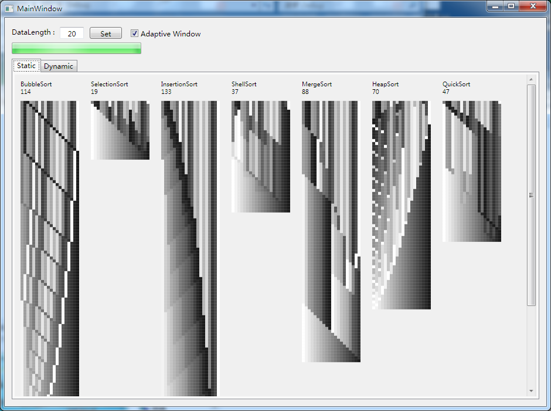
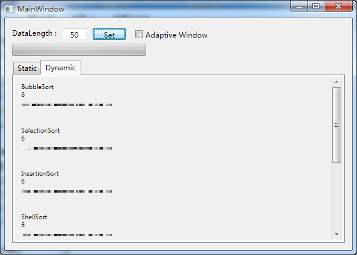

# cat_sort
## 介绍
这是一个演示各种排序算法排序过程的小软件，总共有7中排序算法，分别是：冒泡排序、选择排序、插入排序、希尔排序、归并排序、堆排序、快速排序。软件随机生成若干（由用户设定）个整数（0-255），分别使用以上7种排序算法进行排序，并通过灰度小方格代表数字并演示排序过程。

软件有两种演示方式 ：静态和动态。静态演示打印出排序算法每一次运算过程。

动态演示使用动画显示每一次排序运算。

## 配置和功能
DataLength: 输入演示数据数量，点击 "Set" 开始演示。

Adaptive Window: 自适应窗口大小，（我使用的是14英寸显示器，所以这个功能的窗口最大限值较小）。

Static/Dynamic: 动态、静态演示，选择对应选项卡后再点击 "Set" 进行生成。

*每个排序名称下面的数字表示运算次数。

## Introduction
This is a small software that shows the sorting process of various sorting algorithms. There are 7 sorting algorithms in total. They are bubble sorting, selection sorting, insertion sorting, shell sorting, merge sorting, heap sorting and quick sorting. The software randomly generates integers (0-255), the quantity of integers is set by user. Seven sorting algorithms are used to sort the integers, and the sorting process is showed by representing the numbers with small gray squares.

There are two mode in software to show sorting algorithms: Static and Dynamic. Static mode print every process of sorting algorithms.

Dynamic mode shows them by animation.

## Settings and functions
DataLength: Input quantity of data to sort, then press "Set" to show.

Adaptive Window: Make the software window adaptive with data to show. (I'm using a 14' display so size may be too small for you)

Static/Dynamic: Static mode or Dynamic mode. Choose the tab and press "Set" to create.

*Numbers under every  sort algorithms name show how many processes have done.
